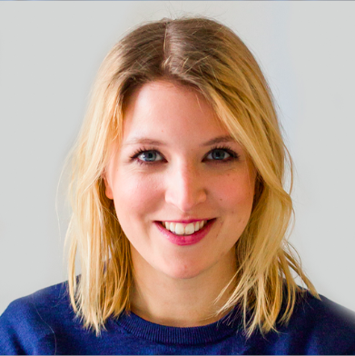
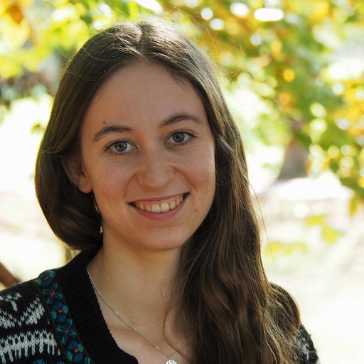
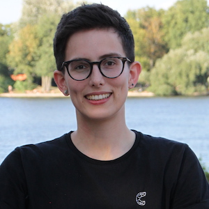

<center>
{#id .class width=15% height=15%}
</center>


# R Lernen - Der Datenkurs von und für die Zivilgesellschaft

## Willkommen

Hallo und herzlich willkommen bei "R Lernen - der Datenkurs von und für die Zivilgesellschaft"! 
Hier findet Ihr alle Informationen zum Kurs, Lernziele und Methodik.

Ersetzt in diesem Codeeditior den Teil mit "--hier dein Name--" mit Eurem Namen. Klickt nun auf "Code ausführen".

```{r paste, exercise=TRUE}
paste("Schön, dass Du da bist, --hier dein Name-- !")
```

```{r paste-solution}
paste("Schön, dass Du da bist, Nina !")
```
Als kleine Vorschau auf das, was wir auf der Lernplattform für Euch vorbereitet haben, könnt Ihr Euch gerne unser Promovideo ansehen:


Am Ende des Kurses könnt Ihr zwei Arten von Datenprodukten erstellen: Einen **reproduzierbaren Bericht**, der automatisch Datenanalysen für mehrere Berichtinstanzen erstellt, und eine **interaktive Web Applikation** zur explorativen Erkundung von Daten. Neugierig? Hier findet Ihr die [App](https://correlaid.shinyapps.io/breakfreefromplastic/){target="_blank"}. Damit Euch zwischendurch nicht die Puste ausgeht, ist jetzt ein guter Zeitpunkt die folgenden beiden Fragen zu beantworten:

- Was ist meine **Motivation** für die Teilnahme an dem Datenkurs "R Lernen"?
- Wo in meinem **Wochenplan** kann ich zwei bis drei Stunden für das Selbststudium vormerken?


### Was Euch diese Woche erwartet
Diese Woche dreht sich alles rund ums Kennenlernen und Aufwärmen. Unten findet Ihr alle wichtigen Informationen zum Kurs nochmal in Schriftform - inklusiver aller wichtigen Links zu [Slack](https://join.slack.com/share/enQtMzI1NDAwODk1NDMzNy03ZTE4MTVjMzBkODVmMWY3ZmI0NWY3MDZkZTcwMmUyYWM0NmUzMjFkZmQ3Y2Q4ZGQ5NmNkYWViNjVjZjM2MmZk){target="_blank"} und der Live-Session am Freitag auf [Zoom](https://us02web.zoom.us/j/88192434515?pwd=K09YMWVnWGtpSzFUNCt0UXFlWG5RQT09&from=addon){target="_blank"}. Lest Euch die Informationen gut durch. Falls es dazu Fragen gibt, können wir diese am **Freitag, den 1.4.22 um 12 Uhr**, nach einer kleinen Vorstellungsrunde klären. Dazu arbeiten wir gemeinsam auf [Mural](https://app.mural.co/invitation/room/1639481246350?code=da1fe041b8544e7a90be8acd5f485d61&sender=ninah9635){target="_blank"}. Gerne könnt Ihr Euch dort schon eintragen. Wie jede Woche wird im Anschluss an unseren Live-Termin das nächste Kapitel freigeschaltet. 

Für diesen Kurs werden wir zudem **Lernduos** bilden. Falls Ihr Präferenzen habt, mit wem Ihr in eine Gruppe kommen möchtet, dann teilt diese Nina (nina.h@correlaid.org) bitte rechtzeitig mit.

Ihr habt außerdem die Möglichkeit von dem Angebot unserer Partner zu profitieren: **[Dataquest](https://www.dataquest.io/){target="_blank"}** unterstützt uns mit kostenlosen Lizenzen für ihre **Data Science Online Kurse**. Für **drei Monate** könnt Ihr dort zusätzlich zu unserem Angebot Kurse in englischer Sprache belegen. Kontaktiert nach Eurer Registrierung bei DataQuest einfach Nina (nina.h@correlaid.org). Aber Augen auf: Programmierkurse für Datenwissenschaftler:innen sind dort meist etwas schwieriger - lasst Euch davon nicht beirren. Unser Kurs ist auf Anfänger:innen gedacht.

Materialien der Lernplattform sind unter **CC-BY 4.0** lizensiert (Open Source mit Autor:innenakkreditierung). Bitte behandelt den **Link zur Lernplattform vertraulich**. 

### Eckdaten 
- 1.4.22 - 17.6.22, Aufwand: 2-4h/Woche
- Blended-Learning mit Lernplattform
- Jeden Freitag live von 12 - 13 Uhr  [(Klick hier!)](https://us02web.zoom.us/j/88192434515?pwd=K09YMWVnWGtpSzFUNCt0UXFlWG5RQT09&from=addon){target="_blank"}
- Mit und von Datenprofis

### Wochenplan
#### Woche 1 (Livetermin 01.04.22): Kick-Off!
Wir stellen uns, Ihr Euch und wir die **Kursmodalitäten** vor.

#### Woche 2 (Livetermin 08.04.22): Daten- und Leuchtturmprojekte der Zivilgesellschaft
Wir präsentieren **Anwendungsbeispiele von Datenprojekten** aus unserem Arbeitsalltag und der Zivilgesellschaft, um einen Ausblick auf Mögliches zu geben. Außerdem verrraten wir unsere Tipps & Tricks, die es bei Datenprojekten zu beachten gilt. Ihr entwickelt erste Ideen für Euer eigenes Projekt.

#### Woche 3 (Livetermin 15.04.22): Datenschutz & -Ethik für Anfänger:innen
Wir führen Euch pragmatisch und lebensnah durch den **DSGVO-Dschungel**, sprechen über Tools und Datenethik. Ihr prüft Euer Projekt auf geltende Regelungen und hinterlegt in einem Datenverarbeitungsverzeichnis die personenbezogenen Daten, die Ihr in Eurem Projekt nutzen wollt. 

#### Woche 4 (Livetermin 22.04.22): Einführung in RStudio
Wir zeigen Euch, was in **RStudio** passiert, wo Ihr die erste Zeile Code schreiben dürft und was für spannende Funktionalitäten es in der Applikation so alles gibt. Ihr öffnet RStudio das erste Mal, probiert Euch aus und - bei Fragen rund um das Set-up - helfen wir Euch.

#### Woche 5 (Livetermin 29.04.22): Daten mit R verstehen
Datenkompetenz setzt voraus, dass Ihr aus Daten die richtigen Schlüsse zieht. Wir zeigen Euch, wie Ihr Daten- und Datenanalysen hinsichtlich ihrer Aussagekraft beurteilt und **Visualisierungen** und **statistische Kennzahlen** richtig interpretiert. Ihr macht erste Codingexperimente.

#### Woche 6 (Livetermin 06.05.22): Datenimport
Wir zeigen Euch, auf wieviele Arten Ihr Daten in RStudio laden könnt - **manuell**, aber vorallem auch **live** - und zeigen, wie wir mit **APIs** arbeiten. Ihr ladet Eure Daten.

#### Woche 7 (Livetermin 13.05.22): Datentransformation
Was tun, wenn die Daten noch gar nicht nutzbar sind? Wir stellen Euch das **tidyverse** der Datentransformation in R vor. Und Ihr? Ihr macht Eure Daten fit für die Auswertung und fangt an statistische Kennzahlen zu berechnen!

#### Woche 8 (Livetermin 20.05.22): Datenvisualiserung
Wir klären, welcher **Diagrammtyp** für Euren Fall der richtige ist und was Ihr bei der Erstellung einer Visualisierung in R beachten solltet. Ihr wendet das Gerlernte an.

#### Woche 9 (Livetermin 27.05.22): Grundlagen der Statistik
Warum **evidenzbasierte Entscheidungen** nicht nur auf Basis von statistischen Kennzahlen und Visualisierungen getroffen werden sollten, erklären wir Euch in dieser Woche. Ihr lernt die Voraussetzungen verschiedener **statistischer Verfahren** kennen.

#### Woche 10 (Livetermin 03.06.22): Reports
Diese Woche lernt Ihr, wie Ihr auf Basis Eurer Kennzahlen, Tabellen und Graphiken mit **RMarkdown** schöne, reproduzierbare Reports erstellt, die Ihr als **PDF- oder HTML-Dokument** teilen könnt. Ihr sucht Euch passende Kennzahlen, Tabellen und Graphiken heraus und erstellt damit einen ersten Report.

#### Woche 11 (Livetermin 10.06.22: Reportautomatisierung
In der vorletzten Phase des Datenkurses lernt Ihr, wie die **Reproduzierbarkeit von RMarkdowns** Euch bei der **Skalierung** von Reporting unterstützt. So könnt Ihr mit geschickten Handgriffen eine große Anzahl an individuellen Reports erstellen. Ihr baut Eure eigene kleine Reportfabrik.

#### Woche 12 (Livetermin 17.06.22): Interaktive Visualisierung
In der letzten Phase des Datenkurses lernt Ihr, wie Ihr Eure Ergebnisse in einer interaktiven Visualisierung teilen könnt. Wir programmieren mit Euch im Kurs eine erste **Shiny-App**, erklären, wie so eine Applikation funktioniert und wie Ihr sie hosten könnt. Ihr übertragt das Gelernte auf Eure eigenen Daten. 

### Lernziele
- Ihr entwickelt ein **Grundverständnis für Datennutzung** (inkl. Grundkonzepte der Mathematik und Statistik für Non-Techs)
- Ihr erlernt **Codesegmente in R** selbst zu formulieren und zu adaptieren 
- Ihr erhaltet eine Einführung in **rechtliche Rahmenbedingungen** (Fokus: DSGVO) und **ethische Bedenken**
- Ihr gewinnt einen Überblick über gängige DSGVO-konforme **Tools zur Datenverarbeitung**
- Ihr versteht **organisatorische Voraussetzungen** und die **Notwendigkeit der strategischen Konzeptionierung** von IT-Neuerungen 

### Methodik
- Jeden Freitag (im Anschluss an unsere Live-Session) veröffentlichen wir neue Materialien auf unserer **Online-Lernplattform**
- Dort findet Ihr dann ein Video, die wichtigsten Kernaussagen des Wochenthemas, Übungsmaterialien und (freiwillige) Lernzielkontrollen
- Die Materialien könnt Ihr bearbeiten, wenn Ihr dafür Zeit und einen freien Kopf habt
- In der Live-Session jeden **Freitag von 12-13 Uhr** besprechen Datenprofis mit Euch die Lösung der Übung und Lernzielkontrolle, die im Anschluss online gestellt wird
- Zusätzlich könnt Ihr **1:1 Sprechstunden** mit den Datenprofis buchen, um parallel an Eurem eigenen Projekt zu arbeiten (entweder direkt in der Sprechstunde oder per Mail an Nina)

### Das Team

<div class="row">
  <div class="col-sm-2">

<h4 style="visibility: hidden;">Nina</h4>
```{r echo=FALSE, out.width="200px"} 

```

  </div>
  <div class="col-sm-10">
  <h4>Nina Hauser</h4>
Nina ist ausgebildete Datenanalystin. Seit 2020 entwickelt
sie für CorrelAid e.V. technische Frameworks und 
Bildungsmaterialien im Bereich Daten. Mit „R Lernen – 
Der Datenkurs von und für die Zivilgesellschaft“ hat sie
ein niedrigschwelliges Bildungsangebot im Bereich 
Data Literacy für zivilgesellschaftliche Organisationen 
geschaffen. Um die Nutzerzentrierung unserer 
Angebote zu sichern, nutzt sie Techniken des Design 
Thinking.

  </div>
</div>


<div class="row">
  <div class="col-sm-2">
<h4 style="visibility: hidden;">Zoé</h4>
```{r echo=FALSE, out.width="200px"} 

```

  </div>
  <div class="col-sm-10">
<h4>Zoé Wolter</h4>
Zoé ist seit 2018 bei CorrelAid aktiv und arbeitet seit Juni 2022 als Werkstudentin für CorrelAid. Nach ihrem Bachelor in ‘Politik- und Verwaltungswissenschaft‘ studiert sie aktuell im Master in Konstanz ‘Social and Economic Data Science‘. So ist sie auch im Local Chapter dort aktiv und war zuletzt für dessen Koordination verantwortlich. Nach zahlreichen Workshops für Studierende an der Universität Konstanz freut sie sich jetzt darauf, auch euch die große weite Welt von R zu zeigen!

  </div>
</div>


<div class="row">
  <div class="col-sm-2">
  <h4 style="visibility: hidden;">Phil</h4>
```{r echo=FALSE, out.width="200px"}

```

  </div>
  <div class="col-sm-10">
<h4>Philipp Bosch</h4>

Phil stärkt als ausgebildeter Datenwissenschaftler die Data
Science Community rund um CorrelAid e.V. Er weiß, wie man
Tech-Communites aufbaut, Begeisterung für neue
Technologien in die Gesellschaft trägt und neue
Partnerschaften akquiriert. Zu seinem Tätigkeitsfeld gehört die
Organisation von Webinaren, Meet-ups, Retreats und
Konferenzen sowie von Wettbewerben. Angefangen bei CorrelAid hat Phil jedoch
mit R-Workshops für Studierende an der Universität Konstanz. Diese Leidenschaft
hat ihn auch während seines weiteren Engagements nie verlassen und er freut sich,
euch während bei “R-Lernen” zu begleiten.
  </div>
</div>

<div class="row">
  <div class="col-sm-2 mt-3">

<h4 style="visibility: hidden;">Frie Preu</h4>
```{r echo=FALSE, out.width="200px"} 

```
  </div>
  <div class="col-sm-10">
<h4>Frie Preu</h4>
Frie Preu ist Gründungsmitglied und arbeitet als Chief Operating Officer von CorrelAid e.V..
Dort organisiert und koordiniert sie unsere Data4Good-Projekte. Frie studierte in Konstanz Social 
and Economic Data Analysis und arbeitete nach dem Studium zwei Jahre als IT-Consultant, bevor sie 2020 ihr langjähriges Engagement zum Beruf machte. Frie nutzt seit fast 10 Jahren R und hat schon viele Personen - Studierende, Freund:innen, CorrelAider:innen - bei ihren ersten Schritten in R und Datenanalyse unterstützt. Sie freut sich darauf, dies bei R-Lernen wieder zu tun.
  </div>
</div>


------
alternativ: Name über bild bei kleinen bildschirmen..

<div class="row">
  <div class="col-sm-2 col-sm-offset-2">
<h4>Frie Preu</h4>
</div>
</div>


<div class="row">
  <div class="col-sm-2 mt-3">
```{r echo=FALSE, out.width="200px"} 

```
  </div>
  <div class="col-sm-10">
Frie ist seit 2015 bei CorrelAid aktiv und ist seit Februar 2020 hauptamtlich angestellt bei CorrelAid. Sie ist dort verantwortlich für die Koordination der Projekte. Zusätzlich dazu wartet und organisiert sie die CorrelAid Infrastruktur und programmiert ab und an gerne interne Tools. Bei alldem kann sie aus ihrer zweijährigen Berufserfahrung als IT Consultant schöpfen, während derer sie viel über Projektarbeit und deren technische Umsetzung lernen durfte.
  </div>
</div>


### Kontakt
Unser Team erreicht ihr unter [education@correlaid.org](mailto:education@correlaid.org). 

Die Hauptkommunikation findet in unserem **Slack-Channel** statt. Zusätzlich habt Ihr die Möglichkeit Euch dort untereinander auszutauschen. Ihr erhaltet die Einladung zu Slack per **E-Mail**, könnt aber auch über diesen [Link](https://join.slack.com/share/enQtMzI1NDAwODk1NDMzNy03ZTE4MTVjMzBkODVmMWY3ZmI0NWY3MDZkZTcwMmUyYWM0NmUzMjFkZmQ3Y2Q4ZGQ5NmNkYWViNjVjZjM2MmZk){target="_blank"} beitreten (Achtung: Der Link ist nur 14 Tage lang gültig).

Alle weiteren Angebot von CorrelAid e.V. erhaltet Ihr jeden Monat in unserem [Newsletter für NPOs](https://correlaid.us12.list-manage.com/subscribe?u=b294bf2834adf5d89bdd2dd5a&id=175fade988){target="_blank"}.

### Und eine kleine Bitte haben wir noch:
Da für uns im Rahmen dieses Kurses allerhand Kosten entstehen und wir diesen gerne langfristig anbieten möchten, würden wir uns freuen, wenn Ihr es auch der **Generation nach Euch** ermöglicht an diesem Kurs teilzunehmen. Wie das geht? Unter **betterplace** könnt Ihr für das Projekt **"R Lernen -  Der Datenkurs für die Zivilgesellschaft"** spenden und den Link gerne auch in Eurem Netzwerk teilen. Pro Teilnehmer:in entstehen uns über die **drei Monate etwa 300€ Kosten** für **Tutor:innen, Hosting und Verwaltung**. Ihr müsst natürlich nicht den Gesamtbetrag spenden - auch kleinere Summen helfen! Das Beste ist: Über betterplace bekommt Ihr sogar eine **Spendenbescheinigung** über Eure Spende, die Ihr so bei der **Steuererklärung** geltend machen könnt.  Überzeugt? Zur Spendenseite: [Klick hier!](https://www.betterplace.org/de/projects/58963-correlaid-e-v-foerderung-von-datenwissenschaft-in-der-zivilgesellschaft){target="_blank"}

<center>
{#id .class width=50% height=50%}
</center>