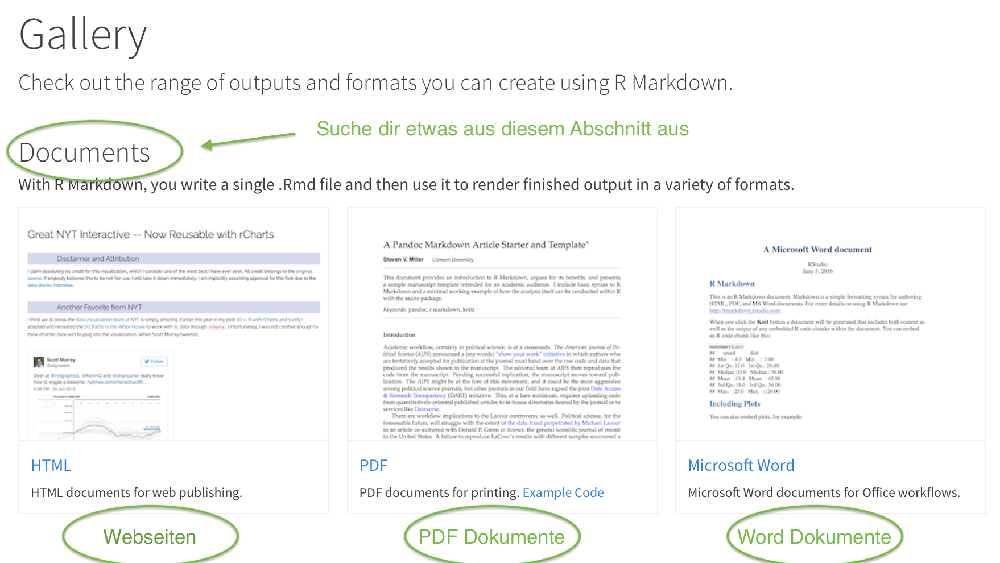

## R Markdown Reports

<!-- Frie: hier wird es wahrscheinlich schwer die übung auf der platform direkt zu machen?  -->

<!-- Nina: Hier nochmal den Unterschied PDF und HTML zeigen - da gibt es bestimmt Fragen zu (Was sind die Vorteile/Nachteile? Wie genau sieht das im Vergleich aus? Wie kann ich das Teilen?)  -->

### Aufbau Video

1.  Kurze Einführung/Wiederholung: Was ist R-Markdown?\

2.  Wofür ist es nützlich?

    1.  --\> unter anderem Reporting (Export Möglichkeiten von RMarkdown)\
    2.  --\> Exercise 1: Explore R-Markdown Gallery, post your fav in slack channel\

3.  Struktur von RMarkdown

    1.  YAML Header\
    2.  Inhalte\
    3.  Knitr Code Chunks\

4.  Inhalte

    1.  Überschriften\
    2.  Text\
    3.  Listen\
    4.  Links\
    5.  Bilder\
    6.  --\> Exercise mit [Tutorial](https://commonmark.org/help/tutorial/)

5.  Code Chunks (wurde evtl schon abgedeckt? Nina: Nein, gerne da ganz ausführlich sein! :) 

    1.  Tabellen einfügen\
    2.  Plots darstellen\

6.  YAML Header

    1.  Basic Funktionen\
    2.  Advanced Optionen
    3.  Params Parameter\
    4.  --\> Exercises: wähle ein theme aus, füge ein Inhaltsverzeichnis ein, toggle sichtbarkeit von chunks

### Kernaussagen
- R Markdown ist ein **Framework**, das es ermöglicht, **reproduzierbare Reports** mit R Code zu schreiben\
- R Markdown ist so beliebt, weil es ermöglicht **alle Schritte einer Datenanalyse an einem Ort** zu sammeln:

    -   Einleitung und Fragestellung (Text)\
    -   Daten importieren, bereinigen & analysieren (Code)\
    -   Ergebnisse darstellen (Code Output)\
    -   Ergebnisse interpretieren (Text)\
    -   Zusammenfassung (Text)\

- Mit **Code, Code Output (z.B. Tabellen oder Plots) und formatierbarem Text** an einem Ort wird es leichter, anderen Menschen die eigene Arbeit zu vermitteln, aber auch Ihr Selbst werdet Euch über Anmerkungen und Erklärungen zu Eurer Analyse freuen, wenn Ihr nach einiger Zeit zu der Datei zurückkehrt\
- In den formatierten Text Eures Reports könnt Ihr außerdem **berechnete Kennzahlen** integrieren, die bei der Aktualisierung der Daten wie der restliche Code Output automatisch geupdatet werden
-  Zudem ist es durch R Markdown leichter Eure Reports auf vielfätige Art und Weise mit Anderen zu **teilen**: Der Export in PDFs, HTML und Word ist möglich \
- Wenn Ihr **statische Reports** erstellen wollt, ist das PDF die richtige Wahl, für mehr Optionen ist eine **HTML**-Datei, die auch im Browser geöffnet werden kann, besser geeignet
-   R-Studio bietet eine sehr gute [**Hilfeseite**](https://rmarkdown.rstudio.com/lesson-1.html){target="_blank"}zu vielen Themen rund um R Markdown in englischer Spreche an - unter anderem ein tolles Einführungsvideo (1min)\
- Daneben gibt es auch noch dieses tolle [**Nachschlagewerk**](https://correlaid.org/material/RMarkdownGuideline.pdf){target="_blank"}


#### Aufbau der R Markdown Datei  

##### 1. Markdown Inhalt  
Nina: Formatierungszeichen zeigen

In R Markdown Dateien steht das **md** in der Dateiendung `meine_datei.Rmd` für **Markdown.** Markdown (ohne R) ist eine einfache Möglichkeit, Text zu formatieren, der auf jedem Gerät gut aussieht. Es macht nichts Besonderes wie das Ändern der Schriftgröße, -farbe oder -art, nur das Wesentliche, mit ein paar nützlichen Tastatursymbolen.  

Zu Beginn lohnt es sich sogenannte [Schummelzettel oder Cheatsheets](https://rmarkdown.rstudio.com/lesson-15.html) zu nutzen, um die Syntax schnell nachschlagen zu können. 
*In R-Studio findet Ihr sie übrigens auch im Menü unter Hilfe > Cheat Sheets.*

##### 2. R Code Blöcke (Chunks)
Code Blöcke habt ihr schon ein wenig kennengelern. Hier eine Übersicht zu den verschiedenen Komponenten und Funktionen

(Übersichtsbild einfügen)

Solche Blöcke könnt ihr schnell in Eure Datei einfügen mit  
- der Tastenkombination Strg + Alt + I (OS X: Cmd + Wahl + I)  
- der Befehl `Chunk hinzufügen` in der Symbolleiste des Editors (grünes C+)  

- einige der bekanntesten Code Block Argumente:  
  - `include = FALSE` verhindert, dass Code und Ergebnisse in der fertigen Datei erscheinen. R Markdown führt den Code weiterhin im Chunk aus und die Ergebnisse können von anderen Chunks verwendet werden.  
  - `echo = FALSE` verhindert, dass Code, aber nicht die Ergebnisse in der fertigen Datei erscheinen. Dies ist eine nützliche Methode zum Einbetten von Abbildungen.  
  - `message = FALSE` verhindert, dass Nachrichten, die durch Code generiert werden, in der fertigen Datei erscheinen.  
  - `warning = FALSE` verhindert, dass Warnungen, die durch Code generiert werden, im Report erscheinen.  
  - `fig.cap = "..."` fügt den grafischen Ergebnissen eine Beschriftung hinzu.

- Um eine Option für alle Code Blocks festzulegen, definiere Sie als global im ersten setup Code Block mit der Funktion `knitr::opts_chunk$set(Argument1 = TRUE)`. Knitr behandelt jede Option, die an knitr::opts_chunk$set übergeben wurde, als globalen Standard, der in einzelnen Chunk-Headern überschrieben werden kann.

##### 3. YAML Kopfzeile
In der YAML Kopfzeile können verschiedene Meta-Parameter festgelegt werden, die für die Verarbeitung der R Markdown Datei wichtig sind.

Der YAML Abschnitt ist für gewöhnlich ganz oben im .Rmd Dateien zu finden und daran zu erkennen, dass er mit `---` umschlossen ist.

### Interaktive Übungen
#### 1. Was ist R Markdown?
```{r 08quiz_reports1}
quiz(caption = NULL,
  question("Welche diese Beschreibungen treffen zu? R Markdown ist... ",
    answer("...📦 ein R-Paket namens rmarkdown.", correct = TRUE),
    answer("...️Zauberei 🧙"),
    answer("...ein Dateiformat zum Erstellen dynamischer Dokumente mit R.", correct = TRUE),
    answer("...ein Tool zum Integrieren von Prosa, Code und Ergebnissen.", correct = TRUE),
    correct = "Richtig!",
    incorrect = "Leider falsch: Versuche es einfach nochmal oder schau im Video nach!",
    allow_retry = TRUE,
    try_again_button = "Nochmal versuchen"
  )
)
```

#### 2. Wofür ist R Markdown nützlich?

**Lass Dich inspirieren**: besuche die [R-Studio R Markdown Gallerie](https://rmarkdown.rstudio.com/gallery.html) und stöbere durch einige Beispiel Reports, die mit R Markdown erstellt wurden. Du kannst zwischen Webseiten, PDF Dokumenten oder Word Dokumenten auswählen. Teile dein Lieblingsbeispiel (als Screenshot und/oder mit Link) im Slack Channel und beschreibe in 1-3 Sätzen, was du daran besonders gut findest.


#### 3. Die drei Komponenten von R Markdown Dateien (.Rmd)
```{r 08quiz_reports2}
quiz(caption = NULL,
  question("Die drei Komponenten aus denen sich R Markdown Dateien zusammensetzen sind:",
    answer("YAML Abschnitt, Inhalt und Code Chunks", correct = TRUE),
    answer("Überschriften, Texte und Bilder", correct = TRUE),
    answer("Code, Tabellen und Grafiken"),
    answer("R, Mark und Down"),
    correct = "Richtig!",
    incorrect = "Leider falsch: Versuche es einfach nochmal oder schau im Video nach!",
    allow_retry = TRUE,
    try_again_button = "Nochmal versuchen"
  )
)
```

#### 3.1 Markdown Inhalt
Markdown

-   10-Min Exkurs: wenn du noch ein bisschen üben willst, wie du deinen Text mit Hilfe von der Markdown Syntax formatieren kannst gibt es hier ein [10-minuten interaktives Tutorial in englischer Sprache](https://commonmark.org/help/), welches ich sehr empfehlen kann

