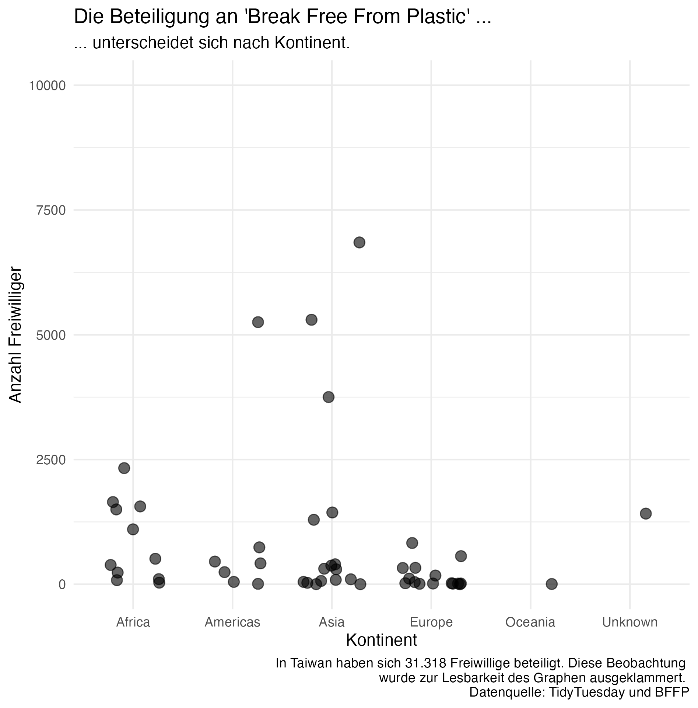

# Datenvisualisierung

Diese Sitzung soll Euch noch mehr Einblicke in die Visualisierungen von Daten geben -- denn was sind die schönsten Daten, wenn man damit keine Informationen vermitteln kann? Wir werden uns diese Woche verschiedene Visualisierungstypen ansehen. 

```{r prep, eval=TRUE, include=FALSE}
library(ggplot2)
library(leaflet)
```

Im Video bekommt Ihr ein bisschen Hintergrund zur Datenvisualisierung und seht Ihr erste Visualisierungsbeispiele, die man so auch in R erstellen kann.

 (ca. 5-10 Minuten)
*Notizen für mich*
*Pest in London als Beispiel für Intro warum data viz*
*dann ein paar Beispiele zeigen*

## Kernaussagen
- Warum nutzen wir Visualisierung?
  - **leichte (und intuitive) Vermittlung von Inhalten**
  - man kann ggf. Muster leichter erkennen
  - wird auch im [Datenjournalismus genutzt](https://www.mzes.uni-mannheim.de/socialsciencedatalab/article/telling-stories-with-data/)
- Welche Visualisierung für welchen Sachverhalt?
  - Diese Entscheidung kann sehr individuell sein
  - Man kann beispielsweise abhängig von der Art der Variablen (kontinuierlich oder diskret) entscheiden
  - Oder aber auch abhängig von der Botschaft (ggf. ist eine Karte intuitiver als ein Balkendiagramm)
  - Die Webseite [Data to Viz](https://www.data-to-viz.com) bietet einen hervorragenden Ausgangspunkt, um sich für eine Visualisierung zu entscheiden und liefert auch gleichzeitig Code Snippets zur Anwendung
- Wie können wir in R visualisieren?
  - eine Vielzahl an Möglichkeiten über verschiedenste Packages (z.B. `ggplot2` oder `leaflet`)

**Nina: Video vielleicht zu den Inhalten: warum visualisieren, welche Viz für welchen Sachverhalt, erste Codesnippets zeigen, eventuell Matching zum Schaubild mit verschiedenen Graphen bei GGPlot?**
**Cosima: Ich bin nicht ganz sicher, was du mit dem Matching hier meinst. Ich hab es aber mal versucht umzusetzen**

Bevor es losgeht noch einmal eine kurze Wiederholung:

```{r 10visualisierung}
quiz(caption = NULL,
  question("Wofür kann man Datenvisualisierung nutzen?",
    answer("dplyr", correct = TRUE),
    answer("shiny"),
    answer("ggplot2", correct = TRUE),
    answer("readr", correct = TRUE),
    answer("haven"),
    correct = "Richtig!",
    incorrect = "Leider falsch: Versuche es einfach nochmal oder schau im Video nach!",
    allow_retry = TRUE,
    try_again_button = "Nochmal versuchen"
  )
)
```


# Visualisierung mit `ggplot2`

Im nächsten Video lernt Ihr eines der wichtigsten Visualisierungspackages in R näher kennen: `ggplot2`
 *Hier wird ggplot2 gerecapped + weitergeführt* (ca. 15 Minuten)

## Kernaussagen
- `ggplot2` 
  - folgt einer **Lagen- bzw. Schichtlogik**, d.h. wir bauen unsere Visualisierung nach und nach auf
  - für einen ganz simplen Plot benötigen wir immer:
    - `data` (der **Datensatz**)
    - `aes()` (die **"ästhetischen Attribute"** wie beispielsweise die x- oder y-Achse)
    - `geom_*()` (die **geometrische Form**, d.h. mit welcher Visualisierungsform Eure Daten dargestellt werden sollen (z.B. in einem Balkendiagramm oder Histogramm) 
- **Wichtig**: die einzelne Bestandteile werden bei `ggplot2` mit einem **"+" verknüpft** 

<left>
{#id .class width=20% height=100%}
</left>
<br>

Die zwei "g" im Packagenamen `ggplot2` stehen für "**g**rammar of **g**raphics". `ggplot2` folgt damit einer "Lagenlogik", nach der eine Visualisierung Stück für Stück aufgebaut wird. Eine ganz einfache Visualisierung mit `ggplot2` erfolgt immer über folgendes Prinzip:

```{r simple, eval = FALSE}
Daten + 
    Ästhetische Attribute  +
    geometrische Formen (z.B. ob es ein Liniendiagramm oder Balkendiagramm ist)
```

Man kann es aber auch komplexer gestalten und erweitern:

```{r complex, eval =FALSE}
Daten + 
    Ästhetische Attribute  +
    geometrische Formen (z.B. ob es ein Liniendiagramm oder Balkendiagramm ist)
    Skalen +
    Koordinatensystem +
    Ggf. Gruppierung der Graphen  +
    Visuelle Anpassung der Darstellungsform (Thema)
```

**Achtung**: Anders als beim sogenannten "pipen" mit `%>%` nutzt `ggplot2` ein `+` um verschiedene Befehle zu kommentieren.

Erinnert Ihr Euch noch an Eure Visualisierung aus der 5. Sitzung? Die folgenden Folien zeigen Euch wie `ggplot2` anhand dieser Visualisierung:

```{r, out.width='100%', out.height='100%'}
knitr::include_url("daten/flip_for_correlaid/flip_for_correlaid.html")
```

Wenn Ihr Euch durch die Folien (am besten über die Pfeiltasten) klickt, seht Ihr, wie sich eine Visualisierung nach und nach aufbaut.

**Achtung**: Auch wenn das Package selbst `ggplot2` heißt, ist der erste Befehl, wenn Ihr Eure Visualisierung aufbaut, immer `ggplot()` (ohne die "2").

Für diese Lektion benötigt Ihr also `ggplot2`.
```{r package prep, exercise = TRUE}
# install.packages("ggplot2")
library(ggplot2)
```

Alle wichtigen `ggplot2` Befehle erhaltet Ihr auch über diesen [Schummelzettel](daten/cheat sheets/data-visualization_de.pdf).

# Verschiedene Visualisierungsformen

`ggplot2` bietet eine Vielzahl an Visualisierungsmöglichkeiten! Die bekanntesten (und wahrscheinlich auch häufigst genutzten) sind:

- `geom_point()`: eine Punktewolke
- `geom_col()`: Balkendiagramm
- `geom_line()`: ein Liniendiagramm (vor allem bei Zeitreihendaten sinnvoll, d.h. Daten, die über mehrere Zeitpunkte abgedeckt werden)
- `geom_histogramm()`: Histogramm (Verteilungsdiagramm)
- `geom_boxplot()`: Boxplot

Das schöne an der `ggplot2` Logik ist, dass man einzelne Komponenten einfach austauschen kann. Das habt Ihr vorhin schon in den Folien gesehen. Wir nehmen das gleiche Beispiel und bauen darauf auf:


<details><summary>Code mit Kommentaren</summary>
```{r code example, eval =FALSE}
ggplot2::ggplot(data = community, aes(x = continent, y = volunteers)) +
  geom_point() # Hinzufügen der Datenpunkte (Scatterplot)
```
</details>

Wenn Ihr zum Beispiel lieber ein Balkendiagramm statt einer Punktewolke (auf Englisch: "scatter plot") möchtet, ersetzt Ihr `geom_point()` durch `geom_col()`. 

``` {r geom_col, exercise = TRUE}
# Visualisierung eines Balkendiagrams
ggplot2::ggplot(data = community, aes(x = continent, y = volunteers)) +
  geom_point() # Hinzufügen der Datenpunkte (ändert diesen Codepart um ein Balkendiagramm zu erhalten)
```

D.h. man kann in der Regel den Darstellungstyp leicht ändern, indem man den `geom_*`-Befehl austauscht. Probiert es einmal aus und visualisiert mit Hilfe von `ggplot2` und ändert das Balkendiagramm in einen Boxplot. Nutzt dazu auch gerne [Schummelzettel](daten/cheat sheets/data-visualization_de.pdf) zum nachschlagen.

``` {r geom_boxplot, exercise = TRUE}
# Visualisierung eines Boxplots

```

# Was kann man noch mit `ggplot2` machen?

Einer ähnlichen Logik folgend könnt Ihr mit `ggplot2` Eure Plots auch individuell gestalten. Wie Ihr in Sitzung 5 schon gesehen habt, kann man zum Beispiel die Beschriftungen ändern. `ggplot2` bietet aber noch viel mehr! Ihr könnt Eure Visualisierung individuell gestalten, indem Ihr die Visualisierungen gruppiert, Farben oder auch das Thema ändert.

## Facets

Wie Ihr auf dem [Schummelzettel](daten/cheat sheets/data-visualization_de.pdf) seht, bietet `ggplot2` aber noch viel mehr! Wir können zum Beispiel Histogramme (also Verteilungsdiagramme) erstellen. Hier bietet sich zum Beispiel eine Darstellung nach Kontinenten an. Dazu nutzen wir den Code von oben und ersetzen unseren `geom_*`-Befehl mit `geom_histogram`. Das müsste doch eigentlich so klappen, oder? Lasst den Code Chunk laufen und schaut Euch die Fehlermeldung an. **Cosima: Sehen die Teilnehmenden die Fehlermeldung?** Was könnte das bedeuten? Nutzt die Information aus der Fehlermeldung und ändert den Code so, dass Ihr ein aussagekräftiges Histogram erhaltet.

```{r geom_histogram, exercise = TRUE}
ggplot2::ggplot(data = community, aes(x = continent, y = volunteers)) +
  geom_histogram()
```

<details><summary>Es führen immer mehrere Wege zum Ziel - hier findet Ihr eine mögliche Lösung</summary>
```{r geom_histogram_solution, exercise = TRUE}
ggplot2::ggplot(data = community, aes(x = volunteers)) +
  geom_histogram()
```
</details>

Was haben wir geändert? Die Fehlermeldung hat uns gesagt, dass `geom_histogram` nur eine x **oder** y Komponente haben kann (*"Error: stat_bin() can only have an x or y aesthetic."*). Deswegen mussten wir uns von einer Information trennen. In diesem Fall haben wir uns entschieden, dass die Verteilung der Kontinente nicht so spannend ist wie die Verteilung der freiwilligen Helfer und haben daher nur `volunteers` behalten. Soweit sieht unser Histogram schon einmal ganz gut aus. Um doch noch die Kontinente als Informationen zu behalten, können wir sogenannte "facets" erstellen. D.h. wir ergänzen einen einzigen Befehl, der uns einzelne Plots für die jeweiligen Kontinente erstellt. Wie das funktioniert seht Ihr in den Folien (nutzt wieder die Pfeiltasten, um Euch durchzuklicken):

```{r, out.width='100%', out.height='100%'}
knitr::include_url("daten/flip_for_correlaid_facet/flip_for_correlaid_facet.html")
```

Ihr sprecht im Befehl `facet_wrap()` über eine Tilde (`~`) die Spalte an, über die Ihr gruppieren möchtet. Bei uns war das `continent`, d.h. unser Befehl sieht so aus: `facet_wrap(~continent)`. 

Im nachfolgenden Code Chunk könnt Ihr es selbst ausprobieren - gruppiert die Anzahl der Freiwilligen nach dem Land (`country`). 

```{r geom_histogram_facet, exercise = TRUE}
ggplot2::ggplot(data = community, aes(x = volunteers)) +
  geom_histogram()
```

## Farben

`ggplot2` erlaubt es Euch auch einzelne Punkte farblich zu färben. Das kann sehr sinnvoll sein, wenn Ihr zusätzliche Informationen übermitteln möchtet. Wir könnten zum Beispiel die Kontinente zusätzlich noch farblich hervorheben. Wie das funktioniert, könnt Ihr Euch noch einmal anhand der folgenden Folien ansehen (nutzt am besten wieder die Pfeiltasten, um Euch durchzuklicken).

```{r, out.width='100%', out.height='100%'}
knitr::include_url("daten/flip_for_correlaid_color/flip_for_correlaid_color.html")
```

Wie Ihr gesehen habt, könnt Ihr innerhalb des `aes()` Arguments zusätzliche Argumente hinzufügen: `color` und `fill`.

- `color` erlaubt Euch zum Beispiel die Punkte einer Punktewolke zu färben
- `fill` wird zustäzlich notwendig, wenn Ihr größere Flächen (wie beispielsweise in einem Histogramm oder einem Balkendigramm färben möchtet)

Wenn Ihr Euch unsicher seid, welches Argument Ihr benötigt, könnt Ihr auch einfach ausprobieren und gegbenenfalls noch `fill` mit dazunehmen.

Nutzt den Code im Code Chunk (das ist ein Code, den wir bereits vorher verwendet haben) und ändert die Farbe der Punkte abhängig von den Ländern (`country`). D.h. wir möchten für jedes einzelne Land eine andere Farbe erhalten.

``` {r geom_scatter_color_country, exercise = TRUE}
# Visualisierung einer Punktewolke
ggplot2::ggplot(data = community, aes(x = continent, y = volunteers)) +
  geom_point() # Hinzufügen der Datenpunkte (Scatterplot)
```

Manchmal sieht das Ergebnis wild aus - wie in diesem Fall auch. Wie wir das verändern können, erfahrt Ihr unter anderem im nächsten Schritt. 

## Themen

Eine weitere beliebte Möglichkeit Eure Visualisierung zu verschönern ist der sogenannte `theme` Befehl in `ggplot2`. `theme` ist unglaublich vielseitig und bieten Euch die Möglichkeit alles so anzupassen, wie Ihr es möchtet. Um `theme` komplett zu verstehen würden wir eine weitere Sitzung dazu benötigen. Daher hier die wichtigsten Informationen in Kürze:

- Es gibt vordefinierte Themen, die Ihr einfach anwenden könnt und so die visuelle Erscheinung Eurer Abbildungen zu verändern (z.B. `theme_minimal()` oder `theme_classic()`)
- Ihr könnt über den Befehl `theme()` auch direkt einzelne Komponenten ansteuern und zum Beispiel Legenden anders positionieren oder zu entfernen. Wer neugierig ist: Eine weitergehende Einführung findet Ihr [hier](https://ggplot2-book.org/polishing.html) (auf Englisch).

Wie das aussehen kann, seht Ihr Euch am besten noch einmal in Ruhe an diesen Beispielen an:

```{r, out.width='100%', out.height='100%'}
knitr::include_url("daten/flip_for_correlaid_themes/flip_for_correlaid_themes.html")
```

Ihr könnt also ganz leicht die gesamte Erscheinung eurer Visualisierung ändern, indem Ihr `theme_*` am Ende Eurer Visualisierung aufruft. Standardmäßig gibt es in `ggplot2` folgende Themen:

- `theme_gray()`: grauer Hintergrund
- `theme_minimal()`: minimalistisches Thema
- `theme_bw()`: schwarz-weiß
- `theme_classic()`: eine klassisch gehaltene Visualisierung
- `theme_dark()`: dunkles Thema
- `theme_light()`: helles Thema
- `theme_void()`: sehr minimalistisches Thema (keine x- und y-Achsen)

Man kann dieses Repertoire durch weitere Packages wie beispielweise `ggthemes` ergänzen und so auch eine Visualsierung im Economist-Stil erzeugen!

- `theme_tufte()`: minimalistisches Thema (inspiriert von Edward Tufte, der einen möglichst optimalen "Informations-Farb-Verhältnis" (data-ink ratio) anstrebt. Kurz gefasst bedeutet es, dass Graphen möglichst simpel gehalten werden sollten)
- `theme_economist()`: inspiriert vom [Economist](https://www.economist.com)
- `theme_stata()`: in Anlehnung an das Statistikprogramm
- `theme_hc()`: in Anlehnung an das JavaScript Package Highcharts
- `theme_excel()`: in Anlehnung an Excel
- `theme_fivethirtyeight()`: in Anlehnung an den Data Blog [FiveThirtyEight](https://fivethirtyeight.com)

und viele mehr -- lasst Euch einfach [inspirieren](https://yutannihilation.github.io/allYourFigureAreBelongToUs/ggthemes/)!


Probiert es doch am besten selbst aus! Ergänzt den folgenden Code durch ein Thema:

``` {r theme_exercise, exercise = TRUE}
# Visualisierung einer Punktewolke
ggplot2::ggplot(data = community, aes(x = continent, y = volunteers)) +
  geom_point() 
# Ergänzt hier Euer gewähltes Thema
```


Dann gibt es noch die Möglichkeit über den `theme()` Befehl auch die Möglichkeit, die Legende auszublenden. Das kann zum Beispiel helfen, um einen Plot übersichtlicher zu machen. Diese Entscheidungen muss man natürlich immer Visualisierungsabhängig treffen. Wenn wir beispielsweise mit unserer Punktewolke aus dem vorherigen Beispiel zeigen möchten, dass es sich um verschiedene Länder auf den Kontinenten handelt, die explizite Nennung der einzelnen Länder an sich aber für uns nicht interessant ist, können wir das in diesem Fall mit dem zusätzlichen Befehl `theme(legend.position = "none")` machen. Übersetzt bedeutet der Befehl, dass wir der Legende keine Position zuweisen - sie erscheint also nicht. 

Kommentiert im Code die Zeile aus, um einen Vergleich mit und ohne Legende zu sehen.

``` {r geom_legend, exercise = TRUE}
# Visualisierung einer Punktewolke mit und ohne Legende
ggplot2::ggplot(data = community, aes(x = continent, y = volunteers, color = country)) +
  geom_point()
  # Um die Legende zu entfernen, kommentiert die folgende Zeile aus 
  # und verbindet die Befehle mit einem `+`
  # theme(legend.position = "none") 
```

# Visualisierung von Karten 

Wie bereits am Anfang erwähnt, hängt die Art der Visualisierung auch stark von Eurer individuellen Präferenz und der Möglichkeit der Daten ab. Wir können die Daten zum Beispiel nutzen, um eine Weltkarte zu visualisieren! Dazu verwenden wir das R package `leaflet`. Die Programmierlogik in `Leaflet` ist ähnlich wie in `ggplot2` oder auch im `tidyverse` (woraus Ihr auch zum Beispiel `dplyr` kennt). 

Um einen ersten Überblick über das Package zu bekommen, schaut Euch am besten das Video an:

 (ca. 20 Minuten)

## Kernaussagen
**To be added**

Hier findet Ihr alle Informationen auch noch einmal im [Schummelzettel zu `leaflet` (auf Englisch)](daten/cheat sheets/leaflet.pdf).

```{r karte, eval=FALSE}

```

# Visualisierungen speichern

Im letzten Schritt lernen wir, wie Ihr Eure erstellen Graphen abspeichert! Dazu liefert das Package `ggplot2` eine Funktion, die es ganz leicht macht: `ggplot2::ggsave`.

Ihr ruft dazu `ggplot2::ggsave` auf und definiert den Dateinamen (`filename`). Ihr könnt beim Dateinamen auch den Pfad mit angeben. Solltet Ihr keinen Pfad angeben wird die Datei automatisch auf der Ebene gespeichert, wo Eure `.R`-Datei liegt. Ihr habt außerdem die Möglichkeit explizit anzugeben, welche Visualisierung Ihr speichern möchtet (standardmäßig sollte das auch die Praxis sein, da man so mögliche Fehler verhindert. Als Standardeinstellung speichert R nämlich die letzte Visualisierung, die Ihr generiert habt.)

```{r ggsave, eval = FALSE}
ggplot2::ggsave(filename = "euer_plot.png") # Ohne Pfad
ggplot2::ggsave(filename = "euer_pfad/euer_plot.png") # Mit Pfad
ggplot2::ggsave(filename = "euer_pfad/euer_plot.png", plot = euer_plot) # Mit explizitem Aufruf der Abbildung
```

In der Praxis sieht der Ablauf dann beispielsweise so aus:

```{r ggsave_example, eval = FALSE}
# Wir erstellen unseren Plot mit `ggplot2` und speichern ihn in einem Objekt (`histogram_plot`)
# über den assignment operator (`<-`)

histogram_plot <-
  ggplot2::ggplot(data = community, aes(x = volunteers)) +
  geom_histogram()

# Im nächsten Schritt rufen wir das Objekt (`histogram_plot`) in der `ggplot2::ggsave` Funktion auf
# und speichern es auf unserem Pfad

ggplot2::ggsave(filename = "euer_pfad/euer_plot.png", plot = histogram_plot) # Mit explizitem Aufruf der Abbildung
```

Dieser Befehl erlaubt es Euch, statische Visualisierungen zu speichern. Für interaktive Visualisierungen wie beispielsweise die durch `leaflet` erstellen Karten, bieten sich andere Formate wie `.html` an.

# Und jetzt seid Ihr dran

1. Überlegt Euch, welche Visualisierung Ihr Euch mit den Daten vorstellen könnt. Schaut Euch zur Inspiration auf [Data to Viz](https://www.data-to-viz.com/) um und wählt eine Visualisierung, die Ihr mit Euren Daten gerne nachbauen würdet. 

2. Setzt die Visualisierung um. Data to Viz liefert neben einer guten Übersicht an Visualisierungsmöglichkeiten auch gleich Code Schnipsel, die Ihr kopieren und auf Eure Daten anwenden könnt.

Das kurze Video zeigt Euch am Beispiel von Histogrammen, wie Ihr Euch zum Beispiel durch die Seite navigieren könnt.


**Cosima: ggf. auf YouTube oder wo anders hochladen? Oder ist es OK so?**

## Weitere Ressourcen
- [Schummelzettel zu `ggplot2`](daten/cheat sheets/data-visualization_de.pdf)
- [Schummelzettel zu `leaflet` (Englisch)](daten/cheat sheets/leaflet.pdf)
- [Data to Viz](https://www.data-to-viz.com/)
- [R Graph Gallery (Übersicht über verschiedene Visualisierungen)](https://www.r-graph-gallery.com/)
- [Online-Version von "ggplot2: Elegant Graphics for Data Analysis" von Hadley Wickham (auf Englisch)](https://ggplot2-book.org/index.html)
- [RStudios Tutorial zu leaflet (auf Englisch)](https://rstudio.github.io/leaflet/)
- [Einblicke in den Datenjournmalismus (auf Englisch)](https://www.mzes.uni-mannheim.de/socialsciencedatalab/article/telling-stories-with-data/)