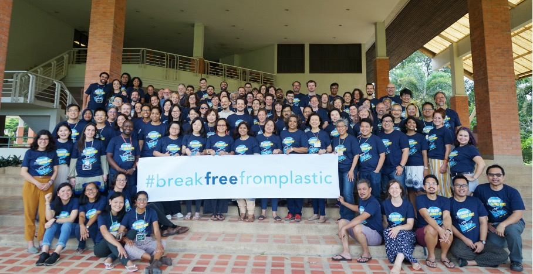

<center>

</center>


<br>
<br>
<br>
<br>

<center>
Ein Bericht von
<center>
{#id .class width=15% height=15%}
</center>

\newpage


# Vorwort
Im Folgenden soll der Datensatz der Break Free From Plastic (fett) Bewegung für das Jahr 2019 und 2020 explorativ erkundet werden. Der Datensatz enthält 13.380 Beobachtungen zu Plastiksammelaktionen in 69 Ländern. Enthalten sind die Variablen  (als Stichpunkte): Land, Jahr, Hersteller des Produktes, Art des gesammelten Plastiks sowie die Anzahl an durchgeführten Events und der Anzahl teilnehmender Freiwilliger.

*Anmerkung: Mehr Informationen zu Break Free From Plastic finden Sie unter diesem [Link](https://www.breakfreefromplastic.org/)*.

```{r setup, include=FALSE}
# Schritt 1: Infrastruktur
knitr::opts_chunk$set(message = FALSE, warning = FALSE)

# Notwendige Packages laden
library(tidyverse)
```

```{r datenimport, include = FALSE}
# Schritt 2: Daten laden
### Daten laden
plastics <- readr::read_csv('https://raw.githubusercontent.com/rfordatascience/tidytuesday/master/data/2021/2021-01-26/plastics.csv')
```

```{r datenbereinigung, include = FALSE}
# Schritt 3: Daten bereinigen
# Country name cleaning: 
  # United Kingdom of Great Britain & Northern Ireland sowie für die USA
plastics_prep <- plastics %>%
  # nur 2019 weil 2020 wegen der Pandemie ein nicht repräsentatives Jahr ist
  filter(year==2019) %>%
  mutate(country = str_replace(country, "United Kingdom of Great Britain & Northern Ireland", "United Kingdom"),
         country = str_replace(country, "United States of America", "United States"),
         country = str_to_title(country) ) %>% #um z.B.: ECUADOR etc case ändern
  #Continent und Country Code anspielen
  mutate(continent = countrycode::countrycode(country, origin = "country.name", destination = "continent"),
         countrycode = countrycode::countrycode(country, origin = "country.name", destination = "iso3c")) %>%
  mutate(continent=replace_na(continent, "Unknown"),
         countrycode=replace_na(countrycode, "Unknown"))

### Community Datensatz erstellen
community<- plastics_prep %>%
  select(country, year, num_events, volunteers, grand_total, continent, countrycode) %>%
  group_by(country, year) %>%
  filter(row_number()==1)

# Audit Plastik Datensatz erstellen
audit_plastic<- plastics_prep %>%
  # nur grandtotal zeile behalten
  filter(parent_company=="Grand Total") %>%
  select(-c(parent_company, num_events, volunteers, empty)) %>%
  #NA zu 0
  mutate(
    across(everything(), ~replace_na(.x, 0))
  )

# EU-Asien Audit Plastik Datensatz erstellen
audit_plastic_eu_asia<- audit_plastic %>%
  filter(continent == "Europe" | continent == "Asia") %>%
  group_by(country) %>%
  mutate(n_types=sum(c(hdpe, ldpe, o, pet, pp, ps, pvc)!=0))
```

```{r ueberblick, include = FALSE}
# Schritt 4: Übersicht verschaffen
dplyr::glimpse(plastics_prep)
```

# Datenbereinigung
Im Jahr 2020 konnten nur wenige Events durchgeführt werden. Nach Betrachtung der Datenlage wurde das Jahr 2020 deshalb von der Analyse ausgeschlossen. Nach der Datenbereinigung verblieben noch insgesamt `r nrow(plastics_prep)` Beobachtungen aus `r length(unique(plastics_prep$country))` Ländern im Datensatz.

# Die Community
Insgesamt wurden weltweit auf `r sum(community$num_events)` Events mit durchschnuttlich `r round(mean(community$volunteers),0)` Freiwilligen `r round(mean(community$grand_total),0)` Plastikstücke gesammelt. Insbesondere in Asien konnte viel Plastik gesammelt werden. Am wenigsten präsent ist die Organisation in den beiden Amerikas. Die Beteiligung flukturiert in unterschiedlichen Ländern stark.

```{r dplyruebung, echo = TRUE}
# Berechnung der Länder- und Freiwilligenanzahl je Kontinent
overview_community <- community %>% # Bezug zum Datensatz
  group_by("Kontinent" = continent) %>% # Gruppierung pro Kontinent
  summarize( # Initialisierung der Berechnung
    # Anzahl beteiligter Länder
    "Anzahl Länder" = n(),
    # Teilnahmezahl der Freiwilligen
    "Anzahl Freiwilliger" = sum(volunteers),
    # Anzahl Plastikstücke
    "Anzahl Plastikstücke" = sum(grand_total))
knitr::kable(overview_community, caption = "Übersicht über Events und Freiwillige")
```

```{r scatterplot, echo = FALSE}
# Erstellung eines Scatterplots zu der Anzahl an Freiwilligen
ggplot(data = community, aes(x = continent, y = volunteers)) + # Initialisierung des ggplots mit Variablen
  geom_point(position = position_jitter(width = 0.3),
             size = 3,
             alpha = 0.6) + # Hinzufügen der Datenpunkte (Scatterplot) inkl. Stylingoptionen zur Positionierung, Punktegröße und Transparenz
  coord_cartesian(ylim = c(0, 10000)) + # Festlegung der Achsenlänge der y-Achse
  labs(
    title = "Die Beteiligung an 'Break Free From Plastic' ..." ,
    subtitle = "... unterscheidet sich nach Kontinent.",
    y = "Anzahl Freiwilliger",
    x = "Kontinent",
    caption = "In Taiwan haben sich 31.318 Freiwillige beteiligt. Diese Beoachtung \nwurde zur Lesbarkeit des Graphen ausgeklammert. \nDatenquelle: TidyTuesday und BFFP"
  ) + # Festlegung der Achsenbezeichungen, Überschriften und Titel
  theme_minimal() # Festlegung des Layout-Designs
```

```{r erstellungdiagramm, echo = FALSE}
# Erstellung eines Punktediagramms mit der Anzahl gesammelter Plastikstücke pro Kontinent
ggplot(data = audit_plastic, aes(continent, grand_total)) + # Initialisierung des ggplots mit Variablen
  geom_point(position = position_jitter(width = 0.3),
             size = 3,
             alpha = 0.6) + # Hinzufügen der Datenpunkte (Scatterplot) inkl. Stylingoptionen zur Positionierung, Punktegröße und Transparenz
  coord_cartesian(ylim = c(0, 15000)) + # Festlegung der Achsenlänge der y-Achse
  labs(
    title = "Beteiligung an 'Break Free From Plastic' ..." ,
    subtitle = "... unterscheidet sich nach Kontinent.",
    y = "Anzahl gefundener Plastikstücke",
    x = "Kontinent",
    caption = "In Nigeria, Philippinen und Taiwan wurden 19.841, 28.055 und \n120.646 Plastikstücke gesammelt. Diese Beoachtungen \nwurden zur Lesbarkeit ausgeklammert."
  ) + # Festlegung der Achsenbezeichungen, Überschriften und Titel
  theme_minimal() # Festlegung des Layout-Designs
```

```{r kennzahlen, echo = FALSE}
# Berechnung statistischer Kennzahlen pro Kontinent
audit_plastic %>%
  group_by(continent) %>%
  summarize(
    # Mittelwert
    menge_mittelwert = mean(grand_total),
    # Standardabweichung
    menge_standardabweichung = sd(grand_total),
    # Median
    menge_median = median(grand_total),
    # Anzahl beteiligter Länder
    länder_anzahl = n(),
    # Summe der Plastikmenge
    menge_summe = sum(grand_total)
  )
```

# Schritt 3: YAML Kopfzeile
<!--

Nun ist es an der Zeit sich über den Output Gedanken zu machen. Dafür bietet sich die YAML Kopfzeile an.
- Ändere das Format des Outputs von PDF zu Word und schließlich zu html.
- Ändere die definierte Autorin
- Ändere die Darstellung von Tabellen mit der Option df_print: "paged", probiere es danach mit df_print: "kable". Schaue dir jeweils den Tabellen Output an: Was gefällt dir besser?
- Pro: schaffst du es das aktuelle Datum einzufügen?
- Setze deinen eigenen Titel
- Füge ein Inhaltsverzeichnis ein mithilfe der `toc: TRUE` Option
- Pro: schaffst du es, das Inhaltsverzeichnis an der Seite schweben zu lassen? (klappt nur, wenn der Output "html_document" ist) 
-->
