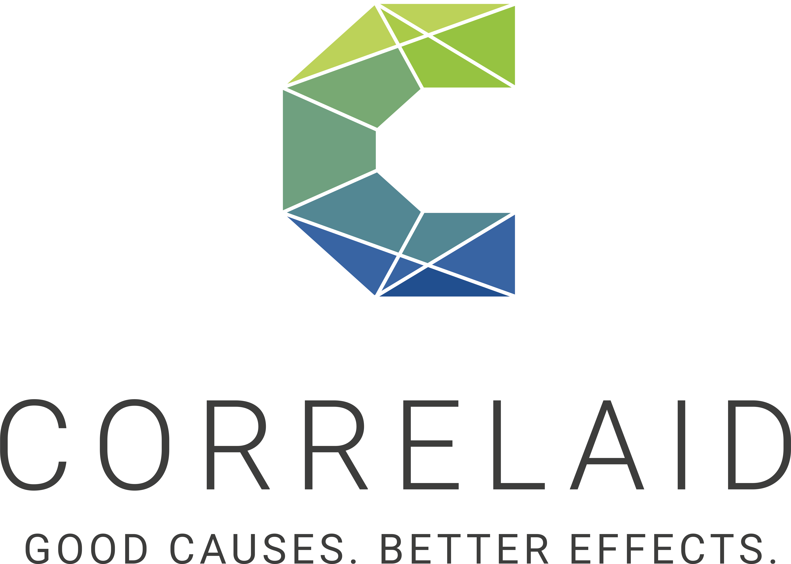

```{r setup-chunk, include=FALSE}
# Schritt 1: Infrastruktur
knitr::opts_chunk$set(
  message = FALSE, 
  warning = FALSE, 
  echo = FALSE
  )

# Notwendige Packages laden
pacman::p_load(
  here,
  lubridate,
  rio,
  tidyverse
  )
```

```{r import-data, include=FALSE}
url_audit <- "https://raw.githubusercontent.com/CorrelAid/lernplattform/main/daten/bffp2019_audit_by_country_and_company.csv"

audit_raw <- rio::import(file = url_audit) %>% 
  # Unpassende Werte Filtern
  dplyr::filter(!parent_company %in% c("Unbranded", "Inconnu", "Assorted"))

audit <- audit_raw
```

<!-- Hier befindet sich ein kleiner Filter-Trick in dem Code-Chunk Header. Der ganze Code-Chunk wird nämlich nur ausgeführt, wenn die Bedingung die hinter `eval=` definiert ist `TRUE` ergibt. In diesem Fall bedeutet das, dass der Code nur ausgeführt wird, wenn der Parameter nicht `alle Kontinente` ist. Wenn also z.B. ein spezifischer Kontinent ausgewählt wurde. Nur dann ergibt es Sinn, den Datensatz zu filtern. -->

```{r wrangle-data-subset-continent, eval= params$filter_continent != "alle Kontinente", include=FALSE}
audit_continent <- audit %>%
  # Kontinent filtern
  dplyr::filter(continent == params$filter_continent)

audit <- audit_continent
```

```{r wrangle-companies, include = FALSE}
# Anzahl Top Ten Hersteller berechnen
parent_company_counts <- audit %>%
  # Zähle die Anzahl der Plastikstücke pro Unternehmen
  dplyr::count(parent_company,
               wt = n_pieces, name = "total_pieces",
               sort = TRUE) 
```

[{width="20%"}](correlaid.org)

# Break Free From Plastic Report

##### Auswertung für `r params$filter_continent`

-   von `Lisa Reiber`
-   *zuletzt generiert: `r lubridate::today()`*
-   *Mehr Informationen zu Break Free From Plastic finden Sie unter diesem [Link](https://www.breakfreefromplastic.org).*

------------------------------------------------------------------------

### Vorwort

Im Folgenden soll der Datensatz der **Break Free From Plastic** Bewegung für das Jahr 2019 explorativ erkundet werden. Enthalten sind Informationen zu: Land, Jahr, Hersteller des Produktes, Art des gesammelten Plastiks sowie die Anzahl an durchgeführten Events und der Anzahl teilnehmender Freiwilliger.

### Datenbereinigung

Im Jahr 2020 konnten nur wenige Events durchgeführt werden. Nach Betrachtung der Datenlage wurde das Jahr 2020 deshalb von der Analyse ausgeschlossen. Auch wurde der Datensatz in zwei Tabellen aufgeteilt: Daten zum Plastikaudit und Daten aus der Gemeinschaft rund um die Bewegung. Nach der Datenbereinigung verblieben noch Daten aus `r length(unique(audit$country))` Ländern und zu `r length(unique(audit$parent_company))` Herstellern im Datensatz.

### 1. Aktivitäten

```{r glue-top3-string, include=FALSE}
top3_string <- glue::glue_collapse(
  x = parent_company_counts$parent_company %>% head(3), 
  sep = ", ", 
  last = " und ")
```

2019 führte Break Free From Plastics mehrere Events mit Freiwilligen durch, kategorisierte die verschiedenen Plastikstücke und sorgte im Anschluss für ihre fachgerechte Entsorgung. Besonders häufig waren Plastikstücke der Firmen `r top3_string`.

```{r print-top10-unternehmen, echo=FALSE}
parent_company_top10 <- parent_company_counts %>% 
  # die Top Ten abspalten
  slice_max(total_pieces, n = 10)

parent_company_top10 %>%
  select(Unternehmen = parent_company, 
         "Anzahl Plastikstücke" = total_pieces)
```

> | --> Das Unternehmen mit den **meisten Plastikstücken** ist `r parent_company_top10 %>% head(1) %>% pull(parent_company)` mit insgesamt `r parent_company_top10 %>% head(1) %>% pull(total_pieces)` Plastikstücken in 2019.

<center>

```{r bar-chart-top10-companies, echo=FALSE}
parent_company_top10 %>%
  # definiere die Variablen in den aesthetics
  ggplot2::ggplot(
    aes(
      x = total_pieces,
      y = fct_reorder(parent_company, total_pieces)
      )
    ) +
  # definiere dass die Daten als Balkendiagramm zum Plot hinzugefügt werden sollen 
  ggplot2::geom_col(
    width = 0.5, fill = "#4E97AC"
    ) +
  # definiere die Labels der Abbildung
  ggplot2::labs(
    title = "Prominente Firmen aus aller Welt ..." ,
    subtitle = "... stellen die gefundenen Plastikverpackungen her.",
    x = "Anzahl an Plastikstücken", 
    y = ""
    ) +
  # definiere den Style der Abbildung
  ggplot2::theme_minimal() +
  ggplot2::theme(
    plot.title.position = "plot",
    panel.grid.minor.y = element_blank(),
    panel.grid.major.y = element_blank()
    )
```

</center>

\newpage

### Eindrücke

<center>


</center>
